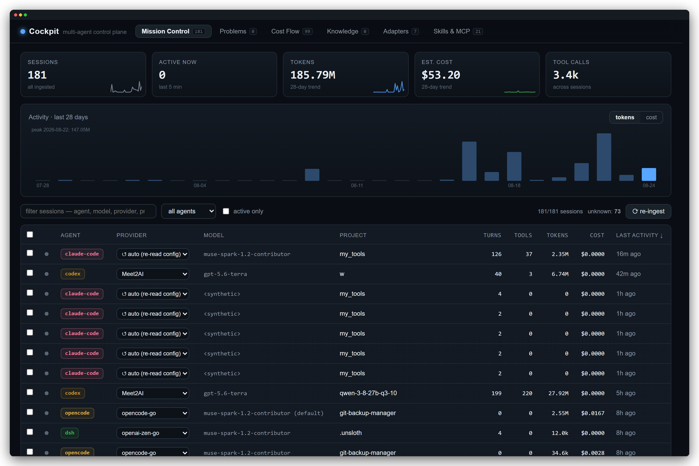
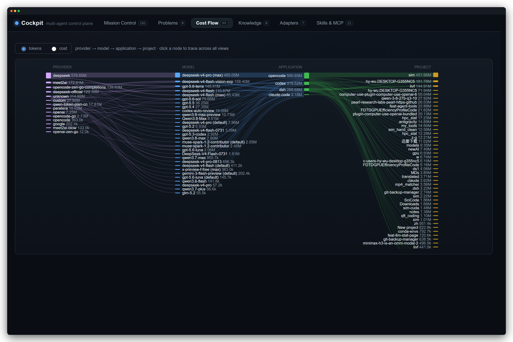
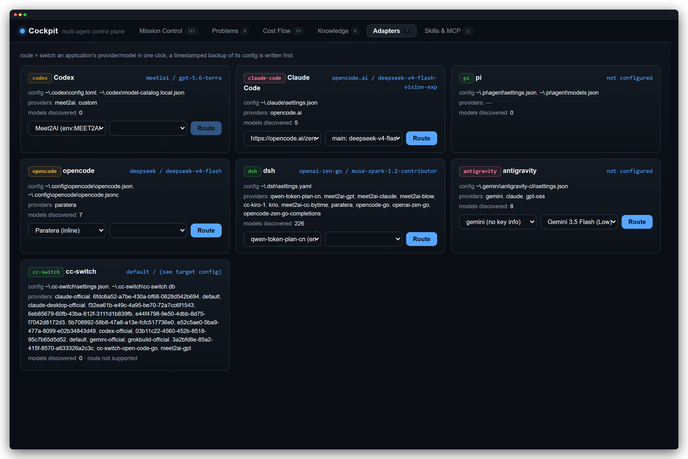
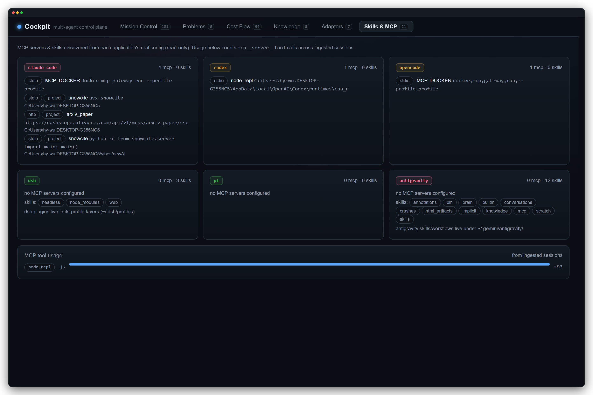

# Cockpit — multi-agent control plane

<p align="center">
  <em>Local cockpit for your coding agents — one place to see every session, trace every token, and route any model.</em>
</p>

<p align="center">
  
</p>

<p align="center">
  <sub><b>Mission Control</b> · 181 sessions · 185M tokens · 28-day activity · filter by agent / provider / model / project</sub>
</p>

---

## Screenshots

<table>
<tr>
<td width="100%" colspan="2">
<a href="docs/images/cost-flow.png"></a>
<p align="center"><sub><b>Cost Flow</b> · Sankey <code>provider → model → application → project</code> · click any node to trace · tokens / cost toggle</sub></p>
</td>
</tr>
<tr>
<td width="50%" valign="top">
<a href="docs/images/adapters.png"></a>
<p align="center"><sub><b>Adapters</b> · 7 apps · one-click <code>route</code> with timestamped config backup · 226 models discovered for dsh</sub></p>
</td>
<td width="50%" valign="top">
<a href="docs/images/skills-mcp.png"></a>
<p align="center"><sub><b>Skills & MCP</b> · 21 servers/skills · read-only discovery from real configs · MCP tool usage aggregated from sessions</sub></p>
</td>
</tr>
</table>

> All screenshots are **retina (2×) captures** with window chrome — rounded corners, traffic lights & soft shadow — generated by [`scripts/capture_screenshots.py`](scripts/capture_screenshots.py) via Playwright.

---

## Session history sources

`ingest` / the re-ingest button parse every local agent's real history:

| Agent | Source | Notes |
|---|---|---|
| pi | `~/.pi/agent/sessions/**/*.jsonl` | native JSONL |
| dsh | `~/.dsh/sessions/**/session.jsonl.zstd` | **multi-frame zstd**, decoded by magic-scan walker in `src/ingest/zstd.ts` (no external deps); provider/model from `request/context` events |
| claude-code | `~/.claude/projects/**/*.jsonl` | usage + `tool_use` blocks incl. `mcp__server__tool` |
| codex | `~/.codex/sessions/**/*.jsonl` | `token_count` deltas, `turn_context` model, `mcp_tool_call_end` normalized to `mcp__server__tool` |
| opencode | `~/.local/share/opencode/opencode.db` | read-only access to opencode's own SQLite (cost included) |
| antigravity | `~/.gemini/antigravity-cli/settings.json` | read/write the persistent `model` field; auth is Google-account OAuth (not touched) |
| qoder | `~/.qoder/projects/*/<sessionId>.jsonl` | Claude-Code-like JSONL; model from `runtime-config`; qoder emits no usage numbers (tokens stay 0) |
| qoder-cn | `~/.qoder-cn/projects/*/<sessionId>.jsonl` | same format, separate install/account |
| grok | `~/.grok/sessions/<url-encoded-cwd>/<id>/chat_history.jsonl` | sparse records; cwd decoded from the directory name |

## Run

```powershell
npm install
npm run build
node dist/cli.js serve            # web UI + API at http://127.0.0.1:4177
```

## Commands

| Command | What it does |
|---|---|
| `serve [--port 4177] [--host 127.0.0.1]` | web UI + API; `--host 0.0.0.0` makes the machine a fleet peer |
| `platforms` | list discovered platforms (local / WSL distros / manual roots) |
| `fleet` | probe fleet peers from `~/.cockpit/fleet.json` |
| `tray [--port 4177]` | **Windows tray host**: background server + gauge icon. Menu: per-agent status rows (click → panel filtered to that agent), open panel, re-ingest all sources, check dsh updates (notify only), open dsh web. Tooltip = active sessions + today's cost |
| `ingest` | parse pi/dsh/claude-code/codex/opencode history into the store, sync registry |
| `adapters` | print current config of every adapted application |
| `route --app <id> --provider <id> --model <id>` | switch an application's model/provider (timestamped config backup first) |
| `knowledge --title <t> [--body <b>] [--tags <a,b>]` | add a knowledge note |

## Skills & MCP view

The `Skills & MCP` tab discovers, read-only, from each app's real config:
MCP servers (`~/.claude.json` global + per-project, `~/.codex/config.toml
[mcp_servers.*]`, opencode config, antigravity `~/.agy/config.json`), and
skills/profiles (`~/.claude/skills`, `~/.codex/skills`, `~/.dsh/profiles`,
`~/.gemini/antigravity/`). Below that, MCP **usage**: counts of
`mcp__<server>__<tool>` calls aggregated from all ingested sessions.

## Multi-platform & fleet

Cockpit reads **every platform it can see from where it runs**:

| Platform | How it is found | Sessions labelled |
|---|---|---|
| Windows/macOS/Linux host | the process home (`~`) | `local` |
| WSL distros | `wsl -l`, home read through `\\wsl.localhost\<distro>` | `wsl:<Distro>` (session ids prefixed `wsl-<Distro>__`) |
| manual roots | `~/.cockpit/platforms.json`: `[{"id":"mac","home":"/Volumes/mac/Users/me"}]` (sshfs / mounted drive) | `root:<id>` |

Every ingester (pi, dsh, claude-code, codex, opencode, grok, qoder, qoder-cn)
runs once per platform, so codex-on-Windows and codex-inside-Ubuntu stay
separate rows with a platform tag; Mission Control has a platform filter.

**Project identity across platforms** is canonicalized: `F:\x`, `/mnt/f/x`
and `\\wsl.localhost\…\x` collapse into one project in Cost Flow and the
projects registry.

**Fleet (MacBook / Ubuntu servers):** those machines run their own
`cockpit serve --host 0.0.0.0`. Register them in `~/.cockpit/fleet.json`:

```json
[
  { "id": "macbook", "name": "MacBook Pro", "url": "http://192.168.1.20:4177" },
  { "id": "gpu-box", "name": "Ubuntu server", "url": "http://192.168.1.30:4177" }
]
```

The **Fleet** tab aggregates each peer live via its read-only `/api/export`
(sessions/tokens/cost per agent + its platform list). Nothing is merged into
the local store, so costs never double-count; `cockpit fleet` prints the same
summary in the terminal.

Notes & limits:

- SQLite over `\\wsl.localhost` cannot take locks, so a WSL opencode store is
  skipped with a warning; run `cockpit serve` inside that WSL distro (or via
  fleet) to read it natively.
- WSL distros are discovered with `wsl.exe`, so this part is Windows-only;
  Mac/Linux hosts just get `local` + fleet.

## Tray implementation notes (Windows)

- Host: `tray/tray.ps1` (PowerShell WinForms NotifyIcon, zero npm deps),
  orchestrated by `src/tray.ts`.
- IPC is **file-based** (`~/.cockpit/tray/cmd.json` / `event.json`,
  tmp+rename): GUI hosts that read piped stdin get killed ~5 s after start by
  some security tooling (observed empirically on this machine).
- The host keeps a 1×1 full-opacity anchor form owning the message loop —
  near-transparent or window-less GUI hosts also get killed by that tooling.
- Debug: set `COCKPIT_TRAY_DEBUG=<log path>`.

### Auto-start at logon (Windows)

Registered as the scheduled task **`Cockpit Tray`** (trigger: at logon,
no execution time limit, restarts twice on failure). Manage it with:

```powershell
Start-ScheduledTask -TaskName 'Cockpit Tray'     # start now
Stop-ScheduledTask  -TaskName 'Cockpit Tray'     # stop
Get-ScheduledTask   -TaskName 'Cockpit Tray'     # inspect
Unregister-ScheduledTask -TaskName 'Cockpit Tray' -Confirm:$false   # remove
```

Action: `node <repo>\corkpit\dist\cli.js tray --port 4177`.

## Companion VS Code extension

See `../cockpit-vscode` — sidebar webview of this UI, status-bar readout
(active sessions / today's cost), and commands to start the server or tray.

---

<p align="center"><sub>Design rationale: <code>2026-08-21-multi-agent-cockpit.md</code> · Captures from <code>cost-flow</code> with 99 flows & 6.7M tokens shown</sub></p>
